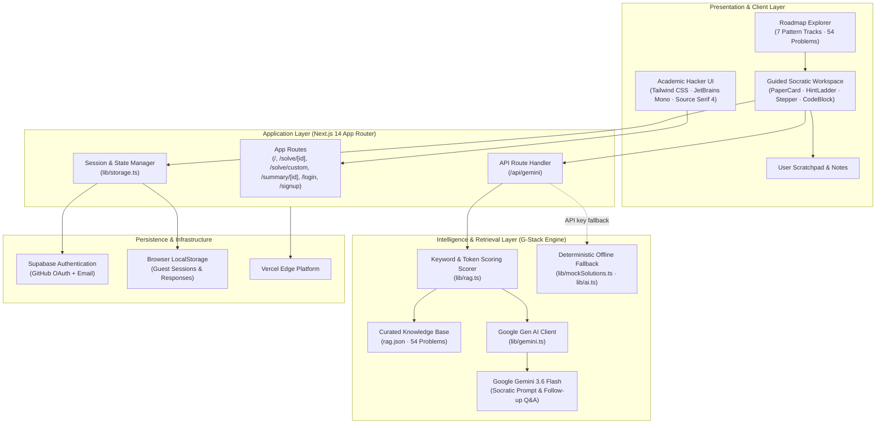
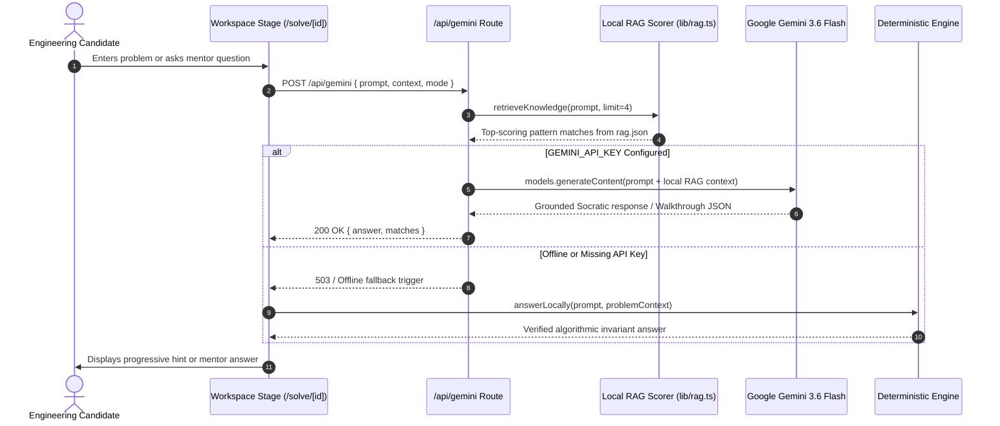

# CodeGuide (>_ Team Blues)

> **Think clearly. Code confidently.**  
> An Academic Hacker Socratic technical interview mentor powered by Local RAG, Google Gemini 3.6 Flash, and Next.js App Router.

```text
[TypeScript 5]  [Next.js 14]  [Gemini 3.6 Flash]  [Local RAG Engine]  [Supabase]  [54 Problems / 7 Tracks]  [88/88 Tests Passing]
```

---

## 1. Overview & Philosophy

**CodeGuide** breaks candidates out of the rote memorization trap. Instead of dumping complete solutions or unformatted chatbot walls of text, CodeGuide guides engineers to discover algorithmic patterns inductively through progressive Socratic hints, proofs of mathematical invariants, and runtime complexity bounds.

### Core Pillars
- **Socratic Discovery over Answer Spoiling:** Five structured learning stages (Understand, Think, Approach, Complexity, Tradeoffs) with progressive hint unlocks.
- **The "Academic Hacker" Aesthetic:** 100% solid surfaces (`#12151c`, `#191e28`), tactile warm ivory paper cards (`#f6f3ec`), sharp rectangular monospaced badges (`[TIME: O(n)]`, `[Easy]`), and high contrast reading typography. Zero glassmorphism, zero rounded pills, zero sparkle emojis.
- **Local RAG + Live Gemini Intelligence:** Every problem query is scored against a local vector/token index of 54 curated FAANG interview problems and passed to Google Gemini 3.6 Flash for grounded, hallucination-free mentorship.
- **Guest-First Resilience:** Instant access without mandatory login; local storage keeps sessions alive, with optional Supabase cloud synchronization.

---

## 2. System Architecture & Stack Diagram

CodeGuide is architected across four high-cohesion layers: Presentation, Application Routing & State, Retrieval & Intelligence (Google Gen AI), and Data & Persistence.

### 2.1 Architecture Diagram



### 2.2 Data Flow Diagram



### 2.3 Technology Stack Matrix

| Layer | Technology | Version | Purpose |
| :--- | :--- | :--- | :--- |
| **Framework** | Next.js (App Router) | `14.2.5` | Hybrid static pre-rendering, server routes, modern React runtime |
| **Language** | TypeScript | `5.x` | Strict type contracts across all data models and walkthrough schemas |
| **AI / LLM** | `@google/genai` | `2.22.0` | Google Gemini 3.6 Flash official client integration |
| **Retrieval (RAG)**| Custom Local Scorer | Built-in | In-memory tokenization, stopword filtration, and problem similarity scoring |
| **Styling** | Tailwind CSS | `3.4.10` | Solid palette tokens, zero-glassmorphism, hairline terminal borders |
| **Icons** | Lucide React | `0.428.0` | Crisp developer iconography (`Terminal`, `Code2`, `GitMerge`) |
| **Auth & Sync** | Supabase JS | `2.45.1` | GitHub OAuth, email authentication, guest session degradation |
| **Verification** | Node.js Test Runner | Built-in | 88 acceptance assertions testing anti-slop rules and track coverage |

---

## 3. Curriculum & Pattern Tracks

CodeGuide includes **100+ curated interview problems** indexed in `rag.json`, organized into 7 structured pattern tracks with 0 orphaned questions:

| Track ID | Track Name | Invariant Focus | Count | Key Problems |
| :--- | :--- | :--- | :---: | :--- |
| `[TRACK 01]` | **Arrays & Hashing** | Hash lookup for O(1) complement matching | 9 | `two_sum`, `contains_duplicate`, `group_anagrams`, `valid_sudoku` |
| `[TRACK 02]` | **Two Pointers & Sliding Window** | Monotonic boundaries without rescans | 8 | `valid_palindrome`, `three_sum`, `longest_substr_no_repeat`, `trapping_rain_water` |
| `[TRACK 03]` | **Intervals & Priority Queues** | Boundary sweeps and top-k streaming | 9 | `merge_intervals`, `meeting_rooms_ii`, `find_median_stream`, `merge_k_sorted_lists` |
| `[TRACK 04]` | **Trees & Binary Search** | Logarithmic pruning and recursive subtree bounds | 7 | `invert_binary_tree`, `validate_bst`, `lowest_common_ancestor`, `search_rotated_sorted_array` |
| `[TRACK 05]` | **Graphs & Grid Traversal** | Multi-source BFS wavefronts and cycle detection | 8 | `number_of_islands`, `course_schedule`, `clone_graph`, `pacific_atlantic_water_flow` |
| `[TRACK 06]` | **Dynamic Programming** | Optimal substructure and topological transitions | 7 | `climbing_stairs`, `house_robber`, `coin_change`, `word_break`, `edit_distance` |
| `[TRACK 07]` | **System & Architecture Design**| Distributed trade-offs and eviction bounds | 6 | `lru_cache`, `design_rate_limiter`, `design_key_value_store`, `url_shortener` |

---

## 4. Release Notes

### v1.0.0 (Production Release)

#### Highlights
- **Unified Repository Consolidation:** Merged `origin/main` (containing Gemini 3.6 Flash backend and local RAG retrieval) and `origin/frontend` (containing the complete academic hacker UI) into a single, clean root project with zero git conflicts.
- **Local RAG Integration:** Implemented in-memory token scoring in `lib/rag.ts` feeding the top 4 matching problem patterns directly into Gemini 3.6 Flash prompts.
- **Interactive Socratic Workspace:** Full 5-stage progressive disclosure pipeline with working Hint Ladder, Invariant proofs, Code Block copy, Time/Space badges, and alternatives matrix.
- **Pattern Tracks Roadmap:** Replaced the flat grid with 7 collapsible tracks, visual difficulty breakdown (`[1 Easy · 4 Med · 1 Hard]`), and real-time search auto-expansion.
- **Anti-AI-Slop Compliance:** Verified zero glassmorphism, zero rounded pills, zero sparkle emojis, and zero conversational fluff.
- **Automated Verification:** 88/88 test assertions passing in `scripts/verify-acceptance.mjs`. Clean production build with zero TypeScript errors.

#### What Changed
- `Added`: `lib/rag.ts` providing in-memory keyword scoring across all 54 problems.
- `Updated`: `app/api/gemini/route.ts` using `@google/genai` and `gemini-3.6-flash`.
- `Updated`: `tsconfig.json` with `target: es2017` and Next.js App Router paths.
- `Cleaned`: Removed duplicate nested `frontend/` directory from `main`.
- `Verified`: Synchronized `frontend` and `main` branches with GitHub.

---

## 5. Getting Started

### 5.1 Prerequisites
- Node.js 18.17+ or 20+
- npm 9+ or pnpm 8+

### 5.2 Installation

```bash
# 1. Clone repository
git clone https://github.com/paulchilemya2024-beep/Team-Blues-LILO-HACKATHON-.git
cd Team-Blues-LILO-HACKATHON-

# 2. Install dependencies
npm install

# 3. Configure environment variables (optional for live Gemini API)
cp .env.example .env.local
```

### 5.3 Environment Variables (`.env.local`)

```bash
# Google Gemini API Key (Optional — CodeGuide runs 100% offline with deterministic fallbacks)
GEMINI_API_KEY=your_gemini_api_key_here

# Supabase Configuration (Optional — Guest Mode is enabled by default)
NEXT_PUBLIC_SUPABASE_URL=https://your-project.supabase.co
NEXT_PUBLIC_SUPABASE_ANON_KEY=your_supabase_anon_key_here
```

### 5.4 Running Development Server

```bash
npm run dev
```

Open [http://localhost:3000](http://localhost:3000) to access the CodeGuide application.

### 5.5 Running Automated Acceptance Tests

```bash
npm test
```

This executes `node scripts/verify-acceptance.mjs`, validating:
- Core App Router and component existence
- Anti-AI-slop code scanner (zero `backdrop-blur`, zero `rounded-full`, zero `✨`)
- 54 curated problem schemas in `rag.json`
- Pattern track mappings (100% problem coverage, 0 orphans)
- Solid color tokens in `tailwind.config.js`

### 5.6 Building for Production

```bash
npm run build
```

Generates optimized, static HTML/JS output ready for Vercel or Node.js production hosting.

---

## 6. Directory Structure

```text
├── app/
│   ├── layout.tsx             # Root HTML layout with JetBrains Mono and Source Serif fonts
│   ├── page.tsx               # Landing page with Hero, Mini-Demo, and Pattern Tracks Roadmap
│   ├── globals.css            # CSS variables, solid panel resets, and paper styles
│   ├── api/
│   │   └── gemini/
│   │       └── route.ts       # Gemini 3.6 Flash route with local RAG context injection
│   ├── (auth)/
│   │   ├── login/page.tsx     # Developer sign-in with guest fallback
│   │   └── signup/page.tsx    # Account registration
│   ├── solve/
│   │   ├── [id]/page.tsx      # Curated 5-step Socratic guided workspace
│   │   └── custom/page.tsx    # Custom pasted problem guided workspace
│   └── summary/
│       └── [id]/page.tsx      # Printable solution recap and notes export
├── components/
│   ├── Navbar.tsx             # Brand header with >_ logo and guest indicator
│   ├── HeroMiniDemo.tsx       # Working landing page hint preview widget
│   ├── ProblemCard.tsx        # Problem card with rectangular tags
│   ├── AuthForm.tsx           # Reusable auth card with guest bypass
│   ├── PaperCard.tsx          # Solid ivory parchment problem statement
│   ├── Stepper.tsx            # 5-step progress navigation
│   ├── HintLadder.tsx         # Progressive Socratic accordion
│   ├── ApproachCard.tsx       # Optimal algorithm and invariant proof
│   ├── CodeBlock.tsx          # Syntax highlighted box with one-click copy
│   ├── ComplexityBadges.tsx   # Rectangular O(n) badges
│   ├── TradeoffTable.tsx      # Brute force vs optimal matrix
│   ├── TutorChat.tsx          # Mentor Q&A input and suggestions
│   ├── UserNotepad.tsx        # Persistent thoughts scratchpad
│   └── CustomProblemModal.tsx # Custom question ingestion drawer
├── lib/
│   ├── rag.ts                 # Local tokenization and similarity scorer
│   ├── problems.ts            # Curated catalog loader and pattern tracks
│   ├── gemini.ts              # Google Gen AI client singleton
│   ├── mockSolutions.ts       # Deterministic walkthroughs for offline mode
│   ├── storage.ts             # LocalStorage persistence manager
│   ├── ai.ts                  # Tutor client with graceful offline fallback
│   └── supabase.ts            # Supabase auth client with fallback
├── types/
│   └── index.ts               # Master TypeScript interfaces
├── scripts/
│   └── verify-acceptance.mjs  # Automated 88-assertion test suite
├── rag.json                   # 54 curated interview problems
├── tailwind.config.js         # Solid palette and typography tokens
└── package.json               # Dependencies and test runner scripts
```

---

## 7. License & Credits

Built with precision by **Team Blues** for the LILO Hackathon. Designed to teach engineers how to think, not what to memorize.
